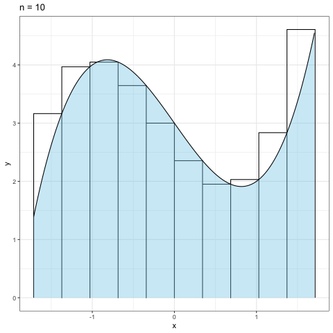

# Riemann-sum-animation
リーマン和の分割数を大きくしていった時の様子を可視化するgifアニメーションを作成する



# How to use  

1. clone this repository with RStudio
2. run the code

```{r}
source("create-riemann-sum-animation.R")
```

3. check the gif file exists. 

# Default settings

- function `f`

$$
  f(x) = x^3 - 2x + 3
$$

- interval $I = [a, b]$
  - $a = -\sqrt{2} - 0.3$
  - $b = \sqrt{2} + 0.3$

If you change `f`, `I`, etc. please see code `create-riemann-sum-animation.R`
